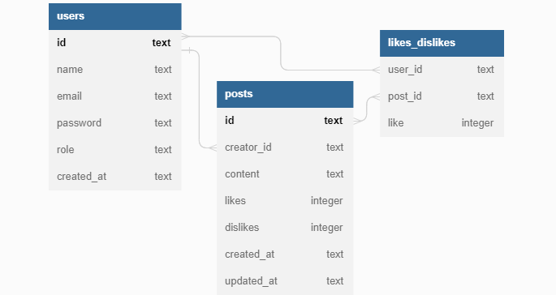

# projeto-labook-backend

O Labook-Backend é o projeto de uma API desenvolvida para uma rede social, com o objetivo de promover a conexão e interação entre pessoas. Quem se cadastrar no aplicativo poderá criar e curtir publicações.

Este projeto foi desenvolvido com base na POO e arquitetura em camadas, onde são realizadas operações CRUD com as entidades users e posts, vinculados ao banco de dados SQLite.

## **Documentação da API:**

[Clique aqui!](https://documenter.getpostman.com/view/25826777/2s93eYUXdH)

## **Funcionalidades do Projeto**

- [x] Cadastrar um novo usuário e devolver um token jwt;
- [x] Fazer login do usuários e devolver um token jwt;
- [x] Fazer um post;
- [x] Visualizar todos os posts;
- [x] Editar post;
- [x] Deletar post;
- [x] Dar like ou dislike em um post.

## **Regras de Negócio**

- Um e-mail só pode ter um cadastro;
- As funcionalidades referentes a entidade posts só podem ser realizadas por usuários cadastrados, através da informação do token obtido quando realizado o cadastro ou login;
- Apenas o usuário que criou o post pode editá-lo, e somente o conteúdo pode ser editado;
- Apenas o usuário que criou o post pode deletá-lo;
- Contas Admins podem deletar o post de qualquer usuário;
- O usúario não consegue dar like ou dislike em seus próprios posts;
- Caso usuário dê um like em um post que já tenha dado like, o like é desfeito;
- Caso usuário dê um dislike em um post que já tenha dado dislike, o dislike é desfeito;
- Caso usuário dê um like em um post que tenha dado dislike, o like sobrescreve o dislike;
- Caso usuário dê um dislike em um post que tenha dado like, o dislike sobrescreve o like

## **Estrutura do Banco de Dados**



## **Tecnologias Utilizadas**

- Node.js
- Typescript
- Express
- Knex
- SQLite
- Zod
- UUID
- Bcrypt
- JWT

## **Programas utilizados**

- VS Code
- Postman

## **Como rodar este projeto?**

```bash
# Clone este repositório
$ git clone https://github.com/AnaliceMarques/projeto-labook-backend.git

# Acesse a pasta do projeto no seu terminal
$ cd projeto-labook-backend

# Instale as dependências
$ npm install

# Execute a aplicação no servidor
$ npm run dev

# A aplicação será iniciada na porta 3003

# Use um API Client para testar as rotas da aplicação
```

## **Próximos passos**

- [ ] Testes unitários;
- [ ] Deploy.

## **Contato**

e-mail: analicemarquessl@gmail.com

Linkedin: https://www.linkedin.com/in/analicemarquessl
